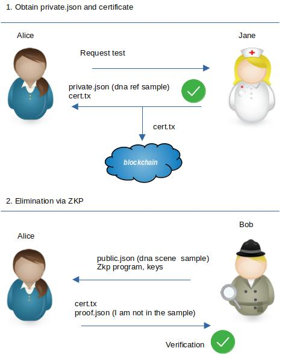

# zdna
## BSV Hackathon 2022 (Zero Knowledge Proof)  

*by Tim Middleton*

Demo Video:  tba   
Hackathon Entry:  https://devpost.com/software/zdna 

For this hackathon I created a Zokrates ZKP function which compares a DNA reference sample to a scene sample.
Using a zero knowledge proof, a person can eliminate themselves as a suspect, while keeping their
DNA information private.

## Rationale

During criminal investigations, DNA samples are taken from crime scenes.  
They may also be requested of people related to the case for the purpose of elimination.  
This system would minimise the need to keep large databases of DNA profiles 
of non-suspects, or staff, which may be hacked, stolen or misused. 

## Overview

In this process there are two phases. 

In phase one, Alice requests a lab to obtain her DNA profile.  
A certificate is generated with a hash of the information and timestamped on the blockchain.  
She can now self custody this information and the lab is required to destroy any copies.   

In phase two, she is given a scene sample and the ZKP program by an investigator.  
She uses the ZKP to prove that her DNA is not a match.  
The investigator can check the certificate against the blockchain.  




## CLI
```
Usage: zdna [options] [command]

Options:
  -V, --version                                                           output the version number
  -h, --help                                                              display help for command

Commands:
  compile [options] [programDir]                                          Compiles the zok program and makes keypair in programDir (default = ./ )
                                                                          Files: artifacts.abi.json, artifacts.program.bin, keypair.pk.bin, keypair.vk.json
  certify [options] <private.json> [outputFile]                           Hash the private.json and write a cert tx in outputFile (default = cert.tx)
  prove [options] <programDir> <private.json> <public.json> [outputFile]  Create the proof in outputFile (default = ./proof.json)
  verify <verificationKey.json> <public.json> <cert.tx> <proof.json>      Verify the proof, using the verification key from programDir and proof.json
  help [command]                                                          display help for command
  
```

## Example Usage

In the repository there is an example folder with a sample private.json and public.json

```
// run with Node.js version 18.4.0
//


// Bob compile
> zdna compile ./example/program

// Alice get her private.json and certificate
> zdna certify ./example/private.json ./example/cert.tx

// Alice receive program and public.json, generates proof.json
> zdna prove ./example/program ./example/private.json ./example/public.json ./example/proof.json

// Bob receive cert.tx and verify the proof.json 
> zdna verify ./example/program/keypair.vk.json ./example/public.json ./example/cert.tx ./example/proof.json

// Or it could be run like this
// > ./bin/zdna ...args
//
```
## Format

### private.json

This is the private input to the zero-knowledge proof.   
This file consists of a json array of 42 numbers, 0 - 255.  
They are actually 21 pairs of numbers.    
Each pair represents a different type of DNA information.  
Zero means no information.   

```
// Example
[ 
  1,2,
  3,7,
  ... 
  4,3 
]
```

### cert.tx - Certify private.json

Certify the private.json file, by putting the hash into the bsv blockchain.  
Create a buffer by converting each number in private.json to a byte, then take the sha256 hash of the buffer.  
The hash is the first public input to the zero-knowledge proof.   
  
It is added to an op_return output in a bsv transaction.  
This version is very simplified, it could be extended with more information and a signature.

### public.json

This is the second public input to the zero-knowledge proof.   
This file consists of a json array of 231 numbers, 0 - 255.  
They are actually 21 sets of 11 numbers.   
Each set represents a different type of DNA information.  
Zero means no information.   

public.json - a json array of 231 numbers, 0 - 255.

```
// Example
[
  1,2,3,4,6,0,0,0,0,0,0,  
  1,2,3,4,6,0,0,0,0,0,0,
  ...
[
```

### Comparison - comp.zok

The function compares each pair in private.json to the corresponsing set in public.json.  

```
// Example

2,7 vs 1,2,4,5,0,0,0,0,0,0,0  

Number 2 is found in the scene.  
Number 7 is not found in the scene.  

This comparison adds 1 to the match count.
```

The comparison function accepts the private.json, hash of private.json, public.json, and returns match count.  
The hash is checked inside the function.

```
// Signature of comparison function
def main (private u8[42] a, u32[8] h1, u8[231] b) -> u8
```

### proof.json - match count

This file is the proof as generated by Zokrates.   
The match count is available as the last element in the 'inputs' array from proof.json.  
It is a number representing how close the match is (a person may partially contribute to a scene sample).  

## Limitations

This is a proof of concept. There are some limitations:
 - The file size of the program and key is large, ~100MB each. I don't know if that can be optimised yet.
 - The DNA comparison is a simplified version, might not cover every edge case.
 - As mentioned, the cert.tx could contain more information in the hash, it could be similar to a birth certificate,
 and allow for other types of proofs.
 - I didn't provide any way of funding and broadcasting the tx in this project, it could be added to another wallet.

## Reference

 - https://zokrates.github.io/toolbox/zokrates_js.html
 - https://www.dnainquiry.qld.gov.au/
